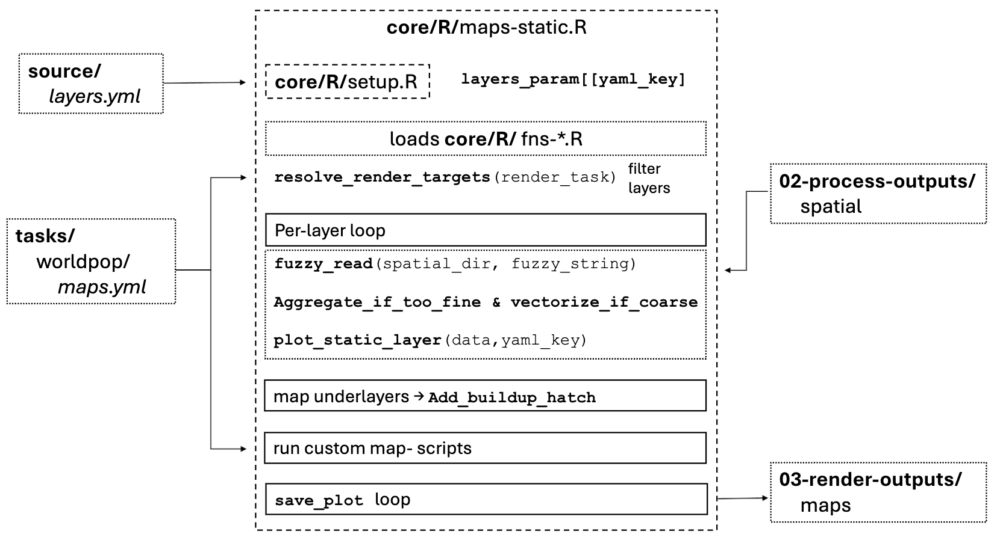
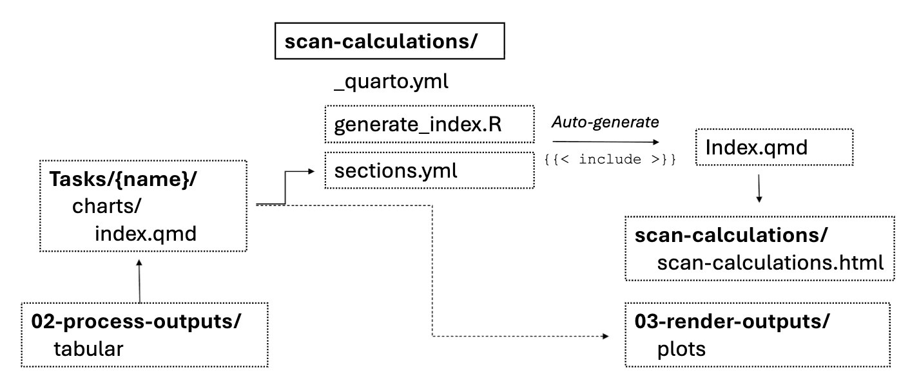

# Workflow Graph

---

## How a static map is built

Inputs feed into `maps-static.R`, which fans out to plot stages, then a save loop writes everything to `maps/*.png`.

**Reading it:**
- `layers.yml` is loaded by `setup.R` into the `layer_params[[yaml_key]]` dict that the plotter reads palette/breaks/subtitle from.
- `maps.yml` is read by `resolve_render_targets()` to filter the layer list when `--render maps` is invoked with a task filter.
- The per-layer loop reads each layer's data file from `02-process-output/spatial` and calls `plot_static_layer()` — that one function carries all the styling.
- Hatch overlays add a `_builtup` variant for select hazard layers (landslides, liquefaction, infrastructure).
- Custom map scripts (e.g. `map-flooding.R`, `map-elevation.R`) are escape hatches for layers needing more than the standard loop.
- `save_plot` writes everything in `plots` to `03-render-output/maps/*.png`.

---

## How `scan-calculations.html` is built

A pre-render script assembles the master qmd from per-task chart includes, then Quarto renders the whole thing.

**Reading it:**
- `sections.yml` defines the order and which sections render; `basic_info.yml` provides conditional skips (e.g. Oxford section only renders for cities in the Oxford Economics database).
- `generate-index.R` is the Quarto pre-render hook — it walks the section list and writes `{{< include ../tasks/{task}/charts/index.qmd >}}` lines into `index.qmd`. Sections without a `charts/index.qmd` are skipped.
- Each per-task chart qmd reads its own CSVs from `tabular/` and embeds plots / maps from `plots/` and `maps/`.
- Quarto renders the assembled qmd into one HTML file.
